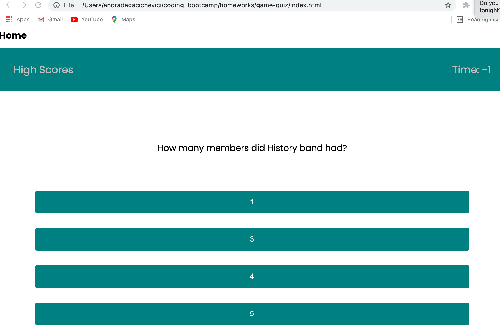

# Game Quiz

Timed coding quiz with multiple-choice questions. This app runs in the browser and features dynamically updated HTML and CSS powered by JavaScript code.

A user clicks through an interactive coding quiz, then enters initials to save the high score before resetting and starting over.

## Application Flow

- GIVEN I am taking a code quiz
- WHEN I click the start button
- THEN a timer starts and I am presented with a question
- WHEN I answer a question
- THEN I am presented with another question
- WHEN I answer a question incorrectly
- THEN time is subtracted from the clock
- WHEN all questions are answered or the timer reaches 0
- THEN the game is over
- WHEN the game is over
- THEN I can save my initials and my score

## Deployed URL

You can view the GitHub pages deployed application [here](https://andradag.github.io/game-quiz/).

## Screenshots

Start Page

First Question

Second Question

Third Question

Game Over

Initials and Score

